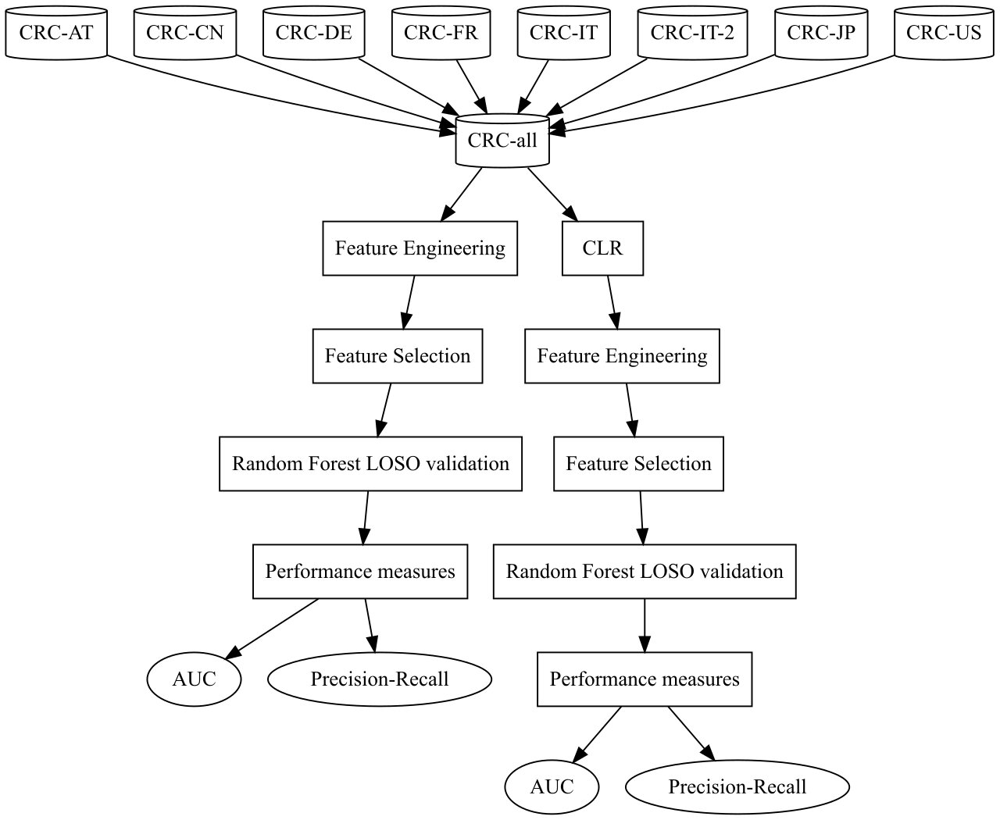

# Feature Engineering for Microbiome Data
Repo for a project done with [Persimune, CHIP](https://www.persimune.dk/) at [Rigshospitalet](https://www.rigshospitalet.dk/).

## Aim
The aim of this research was to find novel feature engineering methods for microbiome
data, which preserve information encoded in this data while also possibly reducing dataset
size. With biological data, it is essential to have explainability and the methods here have
been tried with consideration of this fact. The tools tried are based on a machine learning
classification task of disease vs control. Along with this, the methods tried in this research
have been performed with and without compositional normalization of data. This was done
to help understand why it is important to consider the compositional nature of microbiome
data when doing any analysis.

## Methods
The general workflow followed in this analysis is shown below:

## Results
The details of the analysis and results can be found in this [report](CHIP_report.pdf).

## How to use this repo
To replicate the results obtained in this analysis, follow these steps:
1. Run 0.ipynb 
> This file creates the CRC_all file shown in the workflow and some plots

2. Run 1.1.ipynb and 1.2.ipynb
>1.1 = Control, 1.2 = Control (CRC)

3. Run 2.1.ipynb and 2.2.ipynb
>2.1 = Feature summation, 2.2 = Feature summation (CRC)

4. Run 3.1.ipynb and 3.2.ipynb
>3.1 = Symbolic regression, 3.2 = Symbolic regression (CRC)

